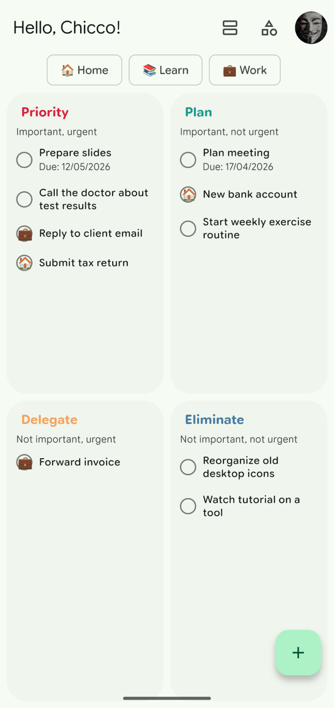
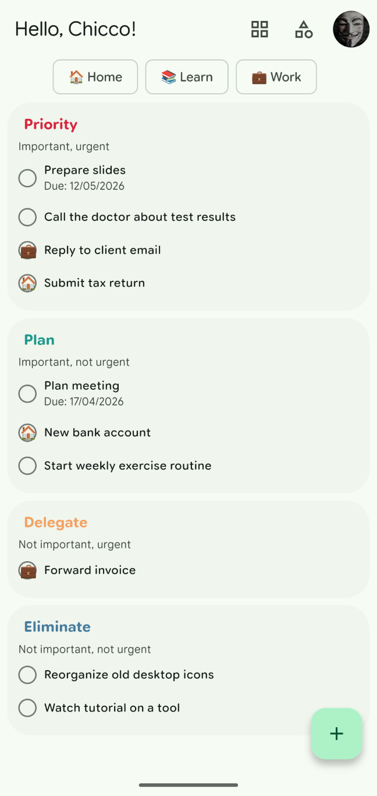
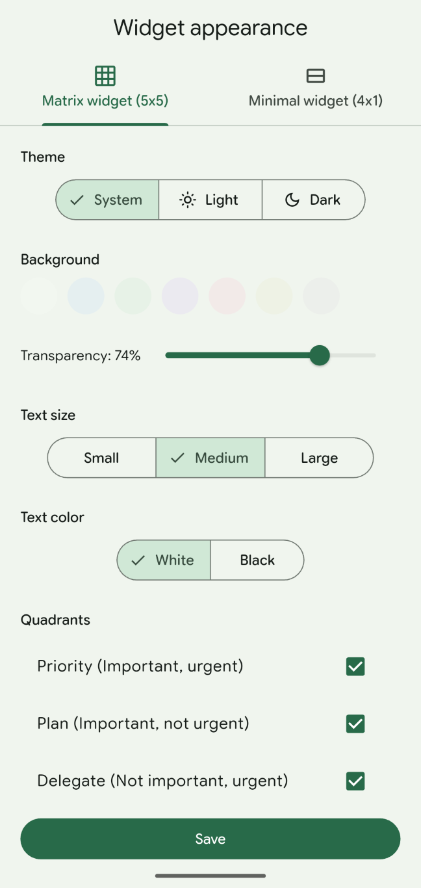
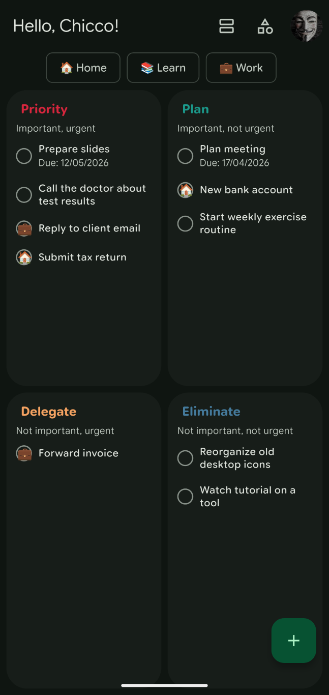

# IkeTasks — Eisenhower to-do app

**Prioritize smarter. Focus on what truly matters.**

IkeTasks is a free, open-source Android app that helps you organize your tasks using the proven Eisenhower Matrix method. Sort everything you need to do into four quadrants based on urgency and importance, and always know what to tackle next.

## Screenshots

  <!--  -->
  
  
  

## Download

Get the latest APK from the [**Releases page**](../../releases/latest).

---

## Features

### 📋 Eisenhower Matrix
Organize all your tasks across four quadrants:

| Quadrant | Description |
|----------|-------------|
| 🔴 **Priority** (Q1) | Urgent & Important — do these now |
| 🟢 **Plan** (Q2) | Not Urgent but Important — schedule these |
| 🟠 **Delegate** (Q3) | Urgent but Not Important — hand off if possible |
| ⚪ **Eliminate** (Q4) | Not Urgent & Not Important — consider dropping |

### ✅ Task Management
- Create tasks with **title**, optional **description**, **due date**, and **category**
- Tap any task to edit or hold it to move it to a different quadrant
- Mark tasks as complete with a single tap
- View and restore completed tasks from the archive

### 🏷️ Categories
- Create custom categories with optional emoji icons (e.g. 💼 Work, 🏠 Home, 📚 Study)
- Filter the matrix by category to focus on one area at a time

### 🏠 Home Screen Widgets
Two widget styles to keep your tasks visible from your home screen:
- **Matrix Widget** — shows tasks from all four quadrants at a glance
- **Minimal Widget** — compact bar for your most urgent tasks
- Fully customizable: theme, background, text size, text color, transparency

### 🔔 Persistent Notification
- Optional notification in your status bar showing your current priority tasks

### ☁️ Cloud Sync and Google Tasks import
- Tasks stored securely in Firebase Cloud, automatically synced across all your devices when signed in with Google
- Import existing tasks from your Google Tasks lists and assign them to quadrants before they land in your matrix
- **Guest mode** — use the full app without a Google account; your data is saved locally on the device and can be linked to a Google account at any time to enable cloud sync

### 🎨 App Theme
- Light & Dark Theme follows your system automatically, built with Material Design 3

### 🌍 10 Languages
- English, Italian, Spanish, French, German, Chinese, Portuguese, Russian, Japanese, Arabic

---

## Getting Started

1. Download the latest APK from the [Releases page](../../releases/latest)
2. Enable *Install from unknown sources* in your Android settings if prompted
3. Open the app and **sign in with Google** for cloud sync, or tap **Continue as guest** to start immediately without an account
4. Start adding tasks!

   > As a guest you can sign in with Google at any time from the settings menu to link your data and enable cross-device sync.

## Sign-In & Data

You can use IkeTasks in two ways:

- **Google Sign-In** — tasks are stored in Firebase Firestore and synced across all your devices. Required to import from Google Tasks.
- **Guest mode** — no account needed. Data is saved in Firebase under an anonymous ID tied to the device. You can upgrade to a Google account at any time from the settings menu to enable cloud sync; if the Google account already exists, you will be notified that guest data cannot be merged.

Your data is never shared with anyone. See the [Privacy Policy](https://thomasborgogno.github.io/iketasks/privacy-policy) for full details.

## Support Development

If you find this app useful, consider supporting its development:

- ☕ [Ko-fi](https://ko-fi.com/thomasborgogno)
- 💳 [PayPal](https://paypal.me/thomasborgogno)

## Contributing

Bug reports, feature requests, and pull requests are welcome!
Open an [issue](../../issues) or email thomas.borgogno99@gmail.com.

## License

This project is open source.
<!-- TODO See [LICENSE](LICENSE) for details. -->
